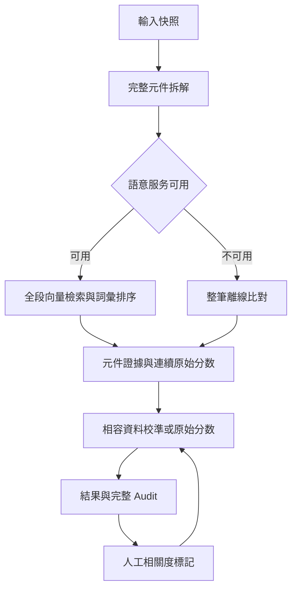

# v3.11 — 優化路線實作

來源：使用者附件「我的優化路線(1).odt」；基礎 commit `c793b7c37a56fe16ab207c608e86f1cbb0d92240`。
附件含 v2 診斷與舊 v3 HTML；本次是在 GitHub v3.10 上修改，沒有以舊版覆蓋。
原 index.html 與來源雜湊保存在 `harness-kit/backups/20260918-roadmap/`。

## 對照

| 附件方向 | 實作與邊界 |
|---|---|
| Embedding 主通道 | 設定 endpoint 後，對所有分段做向量檢索；保留 dense 前 12 與 RRF 前 24 聯集，避免同義改寫被 lexical shortlist 擋掉。語意比對使用 max(0, cosine)，不把正交向量膨脹為 0.5。未設定或失敗時明示 fallback，整筆重算。 |
| 動態詞彙擴充 | Auto 呼叫同服務 `/expand`，以實際向量排序 server/terms.json；最多 5 個相關詞。這是候選詞庫最近鄰，不是無限詞彙生成，也不是確認同義。離線保留本地詞彙；證據內容仍為原文。 |
| 元件拆解、最弱特徵 | 可選服務端 LLM 結構化拆解；逐段精確對回來源，要求所有文字完整覆蓋。失敗改規則完整拆解，無 24 元件靜默截斷。保留最弱元件權重與警示，沒有加入把分數等同法律判斷的 hard gate。 |
| Isotonic 校準 | 同版本、同模型/維度、同設定及同拆解來源的相關度人工標記才可訓練。至少 20 筆，正負各至少 5 筆；每次有效標記更新，計分時排除相同 claim/citation，避免自身標記回灌。少於門檻回原始分數。相同 raw score 先合併，再 PAVA 與線性插值。 |
| Audit Trail | 保存完整輸入快照、原始/最終分數、權重、每個元件 Top-3、實際擴充 query、模型資訊、校準 blocks/sample keys、警示。批次保留每個獨立項的完整结果。可匯出 JSON；最多保留最近 300 次。 |
| 證據上下文 | 長段切成重疊窗口；結果頁可展開原文 Top-3。沒有因短文字被丟棄。超過 2000 段或 128 元件明確要求分批。 |
| 檢索漏斗 | 關鍵字頁新增累積 AND 的逐步檢索式及實際命中數欄位；未串接專利搜尋服務，未填即未查詢，不虛構數字。既有 AI prompt 仍保留。 |



## 修正的資料問題

- 每次比對向量快取重新開始，以 endpoint + 實際送出文字為 key；驗證有限值、非零範數、相同維度，跨批次模型改變會整筆 fallback。
- 結果與標記綁定 SHA-256 pair key：案號、請求項號、引證識別、完整文字及評分 profile。
- 同案號不同文字分開保存；重算同一 pair 清除舊標記。輸入在比對中/比對後變更不會移植舊結果。
- 匯入先完整 schema 檢查，再一次寫入；最多 10 MB / 2000 筆。資料庫載入也驗證，錯誤資料保留原始儲存內容並提示。
- 驗證庫只存文件化欄位，未知欄位不納入；舊版本資料不參與新校準。完整證據另存 Audit。
- 移除活躍頁面未使用的手寫 GOLDEN 向量；既有舊版 backend-tests 留作歷史，不作新版本驗收。
- 缺失 regex 屬性不再直接計成零分；所有屬性皆缺失時採整段詞彙結構相似度。coverage 改為連續軟覆蓋，避免 0.45 邊界跳變。
- UI 人工標記改稱「高度／低度相關」；分數不宣稱 SEP 機率或法律結論。

## 啟動服務

前端仍是靜態頁面，無服務時可離線運作。語意服務是新增的可選 Python adapter，沒有替你部署外部伺服器。

```bash
python -m venv .venv
source .venv/bin/activate
pip install -r server/requirements.txt
export EMBEDDING_MODEL='/absolute/path/to/your/sentence-transformers-model'
export EMBEDDING_REVISION='your-fixed-model-revision'
python server/app.py
```

模型也可填已確認的 Hugging Face model ID，revision 請固定到模型版本。第一次可能需要下載權重。選擇 PatentSBERTa 相容模型時，也要核對其語言覆蓋；中文案件不能假設英文模型自然準確。

另一個終端：`python -m http.server 8080`，開啟 `http://localhost:8080`，填入 `http://localhost:8000/embed` 並測試。服務預設僅綁定 127.0.0.1，CORS 只允許本地 8080 來源。遠端使用時請自行部署受控 adapter，設定 `ALLOWED_ORIGINS`，配置 HTTPS/認證；本次不處理公開服務部署。

LLM 拆解為 opt-in：在服務端設定 `LLM_URL`（完整 chat completions URL）、`LLM_MODEL`，需要時設定 `LLM_API_KEY`，再於前端選擇 LLM 拆解。金鑰不進前端、localStorage 或 Audit。未設定時會回退本地規則。模型回傳不得省略或改寫原文，否則拒絕。

API 契約：

- `POST /embed`：`{"texts":["..."]}` → `embeddings`, `model`, `revision`。長輸入按模型 token 限制分窗、平均並正規化，避免只保留開頭。
- `POST /expand`：`{"term":"...","top_k":5}` → `neighbors`, `model`, `revision`, `vocabulary_revision`。
- `POST /extract`：`{"text":"..."}` → `elements:[{start,end}]`, `model`，offset 使用 JavaScript UTF-16。
- 前端每批最多 32 段、30 秒逾時；相容 embeddings/vectors/OpenAI-style data 回應。未回報模型版本可評分，但不套用 embedding 校準。

## 驗證

```bash
node --test tests/pipeline.test.cjs
python -m unittest discover -s tests -p 'test_*.py' -v
```

本機結果：17 個 JavaScript 行為測試、5 個 Python 服務測試通過。測試直接載入 index.html 的實際函式，不複製舊版評分引擎；Python 包含本地 HTTP/CORS 與精確抽取驗證，encoder/LLM 使用測試替身。

未驗證：真實模型準確度、真實 LLM、外部服務連線、公開部署、瀏覽器視覺/DOM 執行測試。環境有 Playwright 套件但沒有 Chromium binary；JS 行為測試使用 DOM stub，不能宣稱完成瀏覽器或安全全面驗收。沒有可用的獨立標記 holdout；目前權重仍是 provisional，校準不是準確率保證。未另行委派獨立驗收。
